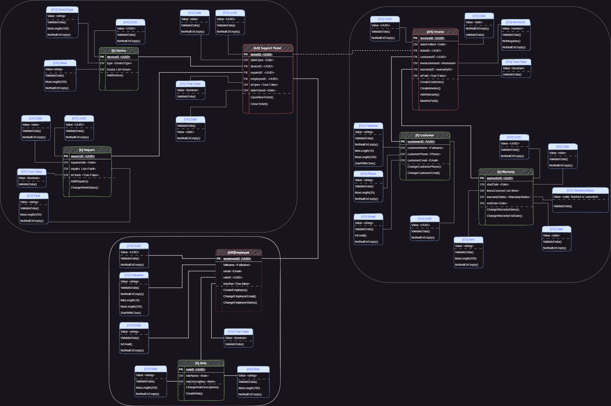

# Technical Service DDD Proyect 

## for C1-2023-Training

### by Edinson Acosta Gancharov

## Summary:

This project implements a solution for a Technical Service using DDD.  
The design carried out in the analysis of the business model has been followed.  
The knowledge acquired in the master classes has been applied, and based on them, an analysis of the problem (Big Picture) has been carried out.  
In addition, the way in which the focus has been made on one of the contexts to be solved (Model) is also explained.

### 
Big Picture 

 

### 
Model

## First delivery:

This first delivery includes, as requested:

* Business analysis and modeling (assets folder)
* project folder structure
* aggregates, entities, value objects, some validations and other required files.

## Second delivery:

This second delivery includes the implementation of the logic of:

* Domain entities
* Aggregates: invoice & employee (completed), support-ticket (in progress)
* Events: publishers and subscribers for Invoice and Employee Entities
* Interfaces: for all aggregates and entities
* Services: 
    + InvoiceService, CustomerService, WarrantyService, EmployeeService, RoleService, TicketSupportService -> completed
    + DeviceService, RepairService -> inProgress
* ValueObjects: all completed with validations.

## Third delivery:

For this third delivery of the project, 12 use cases (minimum) were implemented as required.

* multiple use cases of creation:

    + CreateRoleUseCase
    + CreateEmployeeUseCase
    + AddWarrantyUseCase
    + CreateCustomerUseCase
    + CreateInvoiceUseCase
    + AddDeviceUseCase
    + OpenNewTicketUseCase

* multiple upgrade use cases
    + ChangeRoleDescriptionUseCase
    + ChangeEmployeeEmailUseCase
    + ChangeEmployeeStatusUseCase
    + ChangeCustomerEmailUseCase
    + ChangeCustomerPhoneUseCase

* Model & BigPicture Updated

